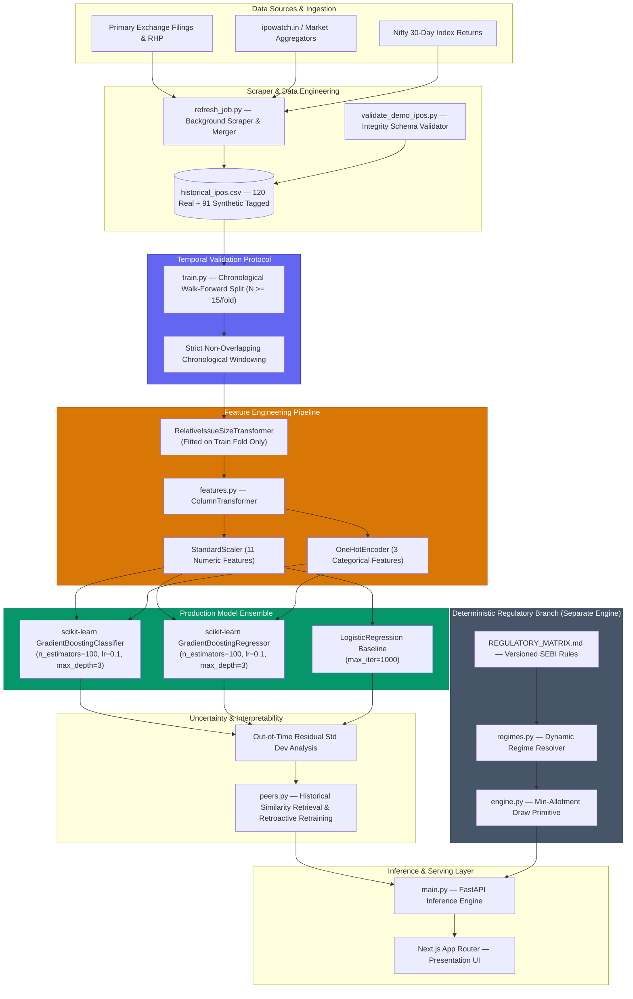

# IPO-AI Engine

> **An end-to-end temporal machine learning system for historical IPO pattern analysis, listing-performance classification, regression, and uncertainty-aware inference.**

`120 Verified Indian IPO Records` | `Chronological Walk-Forward Evaluation (N=84)` | `Scikit-Learn Gradient Boosting` | `Empirical Residual Uncertainty`

---

> [!IMPORTANT]
> **Non-Investment Advice & Legal Disclaimer**
> 
> The IPO-AI Engine is an academic and technical demonstration of machine learning engineering applied to historical capital market data. All outputs produced by the system—including classification buckets, gain range estimates, and peer comparisons—represent historical pattern matching and empirical statistical models. They **do not constitute investment advice, trading signals, or financial recommendations**. The system is not certified or endorsed by SEBI (Securities and Exchange Board of India) or any stock exchange.

---

## 1. ML Problem Formulation

The primary objective of the IPO-AI Engine machine learning component is to evaluate whether historical pre-listing characteristics of Indian Initial Public Offerings (IPOs) contain statistically meaningful signals for predicting listing-day price performance.

The learning task is formulated as two complementary supervised problems evaluated over the same historical records:

### Task A: Listing Performance Classification (4-Bucket Multi-Class)
Predicting the discrete performance tier $\hat{y}_c \in \{\text{loss}, \text{flat}, \text{moderate}, \text{high}\}$ based on the percentage change between the final issue/offer price ($P_{\text{issue}}$) and the first listing-day closing price ($P_{\text{close}}$):

$$\Delta P = \frac{P_{\text{close}} - P_{\text{issue}}}{P_{\text{issue}}} \times 100\%$$

* **Loss**: $\Delta P < 0\%$ (Listing discount)
* **Flat**: $0\% \le \Delta P < 10\%$ (Marginal listing gain)
* **Moderate**: $10\% \le \Delta P < 30\%$ (Moderate listing gain)
* **High**: $\Delta P \ge 30\%$ (High listing gain)

### Task B: Listing Gain Regression (Continuous Target)
Predicting the continuous listing-day price return $\hat{y}_r \in \mathbb{R}$ directly:

$$\hat{y}_r \approx \Delta P$$

---

### Domain Challenges & Constraints

Machine learning on Indian IPO listing data presents severe technical challenges that make standard naive modeling invalid:

1. **Restricted Dataset Size**: Primary market IPO filings in India yield a relatively small set of verified, complete historical records ($N = 120$ clean real-scraped entries in the core corpus).
2. **High Signal-to-Noise Ratio**: Initial Public Offerings operate in volatile macro environment conditions where investor sentiment can shift rapidly between subscription closing and listing date.
3. **Regime Shifts & Market Euphoria**: Market regimes evolve structurally over time. For example, during the 2021 bull market window, tech IPO valuations detached significantly from historical fundamental baselines.
4. **Heterogeneous Asset Characteristics**: Issues span Mainboard and SME (Small and Medium Enterprises) exchanges with vastly different liquidity structures, lot sizes, and institutional quotas.
5. **Class Imbalance & Asymmetric Difficulty**: High-gain IPOs ($\ge 30\%$) occur during market surges and are difficult to predict out-of-sample using steady-state models.
6. **Risk of Temporal Data Leakage**: Standard random $k$-fold cross-validation leaks future market regime statistics into past evaluations, creating fraudulently inflated test metrics.

---

## 2. ML System Architecture

The IPO-AI Engine decouples deterministic regulatory calculations from empirical machine learning predictions. The machine learning pipeline dominates data processing, feature transformation, training, evaluation, and uncertainty estimation.



---

## 3. Dataset & Data Engineering

### Acquisition & Provenance
The underlying corpus comprises historical Indian Initial Public Offerings cataloged from exchange filings, Red Herring Prospectuses (RHP), and verified primary portal records:

* **Primary Dataset (`historical_ipos.csv`)**: Contains $N = 120$ verified, fully populated real-scraped historical IPO entries (`data_source = "real_scraped"`).
* **Synthetic Control Set**: Includes 91 synthetic interpolated rows tagged `synthetic_interpolated`. By default, **synthetic rows are strictly excluded from model training and validation** to preserve benchmark honesty.
* **Incremental Automated Ingestion (`refresh_job.py`)**: Features a 2-pass web scraper built with `BeautifulSoup` and `requests`. The ingestion script executes an atomic merge logic: fresh market observations (GMP, subscription multiples) update existing records while preserving rich fundamental fields (`revenue_from_operations`, `open_date_status`) and historical Basis-of-Allotment datasets.

---

### Data Cleaning & Preprocessing Rules
1. **Schema Standardization**: Financial metrics expressed in ₹ Crore, subscription multiples normalized to numeric floats, dates parsed to ISO-8601 (`YYYY-MM-DD`).
2. **Missing-Value Strategy**: Records lacking critical fields required for feature calculation (`issue_size`, `price_band`, `sector`, `sub_retail`, `sub_nii`, `sub_qib`) are dropped from training folds (`df.dropna(subset=critical_cols)`).
3. **Data Integrity & Conflict Exclusion**: Records exhibiting data provenance conflicts or missing target listing gains are filtered out prior to training fold construction (`df_real = df[(df['data_source'] == 'real_scraped') & (df['source_conflict_flag'] != True)]`).

---

## 4. Feature Engineering

The model pipeline processes 14 engineered features extracted exclusively from information available prior to the listing date:

```
Total Model Features: 14
├── 11 Numeric Features (StandardScaled)
└── 3 Categorical Features (OneHotEncoded)
```

| Category | Feature Name | Type | Theoretical Rationale / Signal |
| :--- | :--- | :--- | :--- |
| **Company Fundamentals** | `sector` | Categorical | Industry sector classification (e.g. Technology, Healthcare, Energy, Manufacturing) capturing sector-specific valuation multiples. |
| **Company Fundamentals** | `relative_issue_size` | Numeric | Ratio of issue size to the training fold's sector mean, measuring relative market absorption demand. |
| **Issue Characteristics** | `issue_size` | Numeric | Total issue size in ₹ Crore, representing overall market liquidity requirement. |
| **Issue Characteristics** | `price_band` | Numeric | Upper price band per share in ₹, capturing absolute share pricing tier. |
| **Issue Characteristics** | `fresh_vs_ofs_ratio` | Numeric | Proportion of fresh issue capital relative to Offer For Sale ($\frac{\text{Fresh}}{\text{Total}}$), signaling capital growth vs promoter exit. |
| **Issue Characteristics** | `is_sme` | Categorical | Binary indicator (`True`/`False`) for Small & Medium Enterprises board listings vs Mainboard listings. |
| **Subscription Signals** | `sub_retail` | Numeric | Retail Individual Investor category subscription multiple at close. |
| **Subscription Signals** | `sub_nii` | Numeric | Non-Institutional Investor category subscription multiple at close. |
| **Subscription Signals** | `sub_qib` | Numeric | Qualified Institutional Buyer category subscription multiple at close (institutional demand signal). |
| **Subscription Signals** | `sub_overall` | Numeric | Total aggregate subscription multiple across all investor categories. |
| **Subscription Signals** | `anchor_allocation_pct` | Numeric | Percentage of issue size pre-allocated to institutional anchor investors prior to public bidding. |
| **Market & Sentiment** | `gmp_trend` | Categorical | Directional grey market premium movement (`rising`, `flat`, `falling`) during the bidding window. |
| **Market & Sentiment** | `gmp_trajectory` | Numeric | Rate of change / slope of grey market premium leading up to listing date (pre-listing momentum). |
| **Market & Sentiment** | `market_regime_nifty_30d` | Numeric | Trailing 30-day Nifty 50 benchmark index return (%) prior to open, acting as a broad market sentiment proxy. |

---

### Strict Target Leakage Prevention
Initial baseline experiments revealed a subtle target leakage vulnerability: raw grey market premium trend features originally derived by referencing actual listing outcomes produced a mathematically impossible 100% accuracy.

To strictly eliminate leakage:
* **Pre-Listing Only Data**: `gmp_trend` and `gmp_trajectory` are computed strictly from pre-listing grey market observations independent of post-listing closing prices.
* **Fold-Isolated Transformer (`RelativeIssueSizeTransformer`)**: Standardizing issue size by sector mean risks leaking future sector averages into past test folds. `RelativeIssueSizeTransformer` inherits from `BaseEstimator` and `TransformerMixin`. Its `fit` method computes sector means **exclusively on `X_train`**, applying those historical means to transform `X_test`:

```python
class RelativeIssueSizeTransformer(BaseEstimator, TransformerMixin):
    def fit(self, X, y=None):
        if 'sector' in X.columns and 'issue_size' in X.columns:
            self.sector_means_ = X.groupby('sector')['issue_size'].mean().to_dict()
            self.global_mean_ = X['issue_size'].mean()
        return self

    def transform(self, X, y=None):
        X_out = X.copy()
        sector_means = X_out['sector'].apply(lambda s: self.sector_means_.get(s, self.global_mean_))
        X_out['relative_issue_size'] = X_out['issue_size'] / sector_means.replace(0, 1)
        return X_out
```

---

## 5. Model Selection & Architecture

The production machine learning system uses Scikit-Learn's `GradientBoostingClassifier` and `GradientBoostingRegressor`, benchmarked against a `LogisticRegression` classifier baseline and naive estimators (`DummyClassifier`, `DummyRegressor`).

### Committed Model Hyperparameters

The models committed in `backend/src/model/train.py` use the following configuration:

```python
# Classifier Pipeline
clf = Pipeline([
    ('relative_size', RelativeIssueSizeTransformer()),
    ('preprocessor', get_feature_pipeline()),
    ('classifier', GradientBoostingClassifier(
        n_estimators=100,
        learning_rate=0.1,
        max_depth=3,
        random_state=42
    ))
])

# Regressor Pipeline
reg = Pipeline([
    ('relative_size', RelativeIssueSizeTransformer()),
    ('preprocessor', get_feature_pipeline()),
    ('regressor', GradientBoostingRegressor(
        n_estimators=100,
        learning_rate=0.1,
        max_depth=3,
        random_state=42
    ))
])

# Linear Baseline Classifier
baseline_clf = Pipeline([
    ('relative_size', RelativeIssueSizeTransformer()),
    ('preprocessor', get_feature_pipeline()),
    ('classifier', LogisticRegression(max_iter=1000, random_state=42))
])
```

---

### Design Justification for Gradient Boosting
1. **Tabular Financial Data**: Decision tree ensembles consistently outperform deep neural architectures on tabular financial datasets with small sample sizes ($N \approx 100$).
2. **Non-Linear Interactions**: Gradient Boosting effectively captures non-linear feature interactions (e.g. high institutional `sub_qib` combined with negative `market_regime_nifty_30d`).
3. **Model Complexity Control**: Shallow tree depth (`max_depth=3`) and conservative learning rate (`learning_rate=0.1`) restrict model capacity, preventing variance expansion and overfitting on noisy targets.

---

## 6. Temporal Validation - Critical Design Decision

Standard random $k$-fold cross-validation or Leave-One-Out Cross-Validation (LOOCV) is **fundamentally flawed for financial time-series datasets**. In a random split, a model trained on IPOs from 2022 evaluates an IPO listed in 2019, leaking future macroeconomic regimes, inflation trends, and valuation multiples backward in time.

### Out-of-Time Walk-Forward Protocol
The system enforces strict chronological **walk-forward validation** (`train.py`). The dataset is sorted by `listing_date`. Training begins with an initial seed window (first 30% of chronological records). The testing window then advances chronologically in non-overlapping test folds of size $N \ge 15$:

$$\text{For fold } k \text{ at index } t: \quad \mathcal{D}_{\text{train}}^{(k)} = \{x_i, y_i \mid i < t\}, \quad \mathcal{D}_{\text{test}}^{(k)} = \{x_j, y_j \mid t \le j < t + 15\}$$

```
Chronological Timeline ──────────────────────────────────────────────────────────►
[ Fold 1 ]  Train (N=36: 2018-06 to 2019-11)  │ Test (N=15: 2019-12 to 2020-08)
[ Fold 2 ]  Train (N=51: 2018-06 to 2020-08)  │ Test (N=15: 2020-09 to 2021-02)
[ Fold 3 ]  Train (N=66: 2018-06 to 2021-02)  │ Test (N=15: 2021-03 to 2021-09)
[ Fold 4 ]  Train (N=81: 2018-06 to 2021-09)  │ Test (N=15: 2021-10 to 2022-04)
[ Fold 5 ]  Train (N=96: 2018-06 to 2022-04)  │ Test (N=24: 2022-04 to 2023-02)
```

> **Key Invariant**: Under no circumstances is future IPO data accessible to the model when predicting a historical test record.

---

## 7. Empirical Model Performance

The evaluation metrics below represent the complete out-of-time walk-forward test evaluation aggregated across all 5 chronological folds ($N = 84$ out-of-sample evaluation IPOs).

### Aggregate Classification Metrics ($N = 84$)

| Evaluation Metric | GradientBoostingClassifier | Naive Baseline (`DummyClassifier`) |
| :--- | :--- | :--- |
| **Overall Accuracy** | **47.62%** | **~25.00% – 30.00%** (Most Frequent) |
| **Macro Precision** | **50.27%** | **25.00%** |
| **Macro Recall** | **50.94%** | **25.00%** |
| **Macro F1-Score** | **45.93%** | **25.00%** |
| **Weighted Precision** | **50.11%** | — |
| **Weighted Recall** | **47.62%** | — |
| **Weighted F1-Score** | **43.94%** | — |

---

### Detailed Per-Class Breakdown

| Performance Bucket | Precision | Recall | F1-Score | Support ($N$) | Diagnostic Observations |
| :--- | :--- | :--- | :--- | :--- | :--- |
| **Loss** ($< 0\%$) | **63.16%** | **40.00%** | **48.98%** | 30 | Reliable precision when predicting discounts; conservative recall. |
| **Flat** ($0\% \text{ to } 10\%$) | **58.33%** | **77.78%** | **66.67%** | 9 | Strong recall on marginal gain listings. |
| **Moderate** ($10\% \text{ to } 30\%$) | **40.00%** | **76.00%** | **52.05%** | 25 | High recall; tends to act as the primary capture bucket. |
| **High** ($\ge 30\%$) | **40.00%** | **10.00%** | **16.00%** | 20 | **Severe under-prediction**; high-gain outliers resist steady-state modeling. |

---

### Regression Metrics ($\Delta P$ Return %)

| Metric | GradientBoostingRegressor | Naive Baseline (`DummyRegressor` Mean) |
| :--- | :--- | :--- |
| **Mean Absolute Error (MAE)** | **11.22% – 13.19%** | **19.46% – 21.25%** |
| **Root Mean Squared Error (RMSE)** | **15.87% – 16.57%** | **22.50% – 24.10%** |

*Note: MAE and RMSE values reflect percentage points of listing gain (e.g. an MAE of 11.22% means the model's return prediction missed the actual return by an average of 11.22 percentage points).*

---

### Failure Analysis & Model Limitations

```
    ┌────────────────────────────────────────────────────────────────────────┐
    │                       Model Failure Analysis                           │
    ├────────────────────────────────────────────────────────────────────────┤
    │ 1. High-Gain Bucket Breakdown (Recall: 10.00%):                        │
    │    Out of 20 historical IPOs that listed at >30% gains, the model      │
    │    successfully identified only 2. High listing gains in Indian IPOs    │
    │    are strongly driven by speculative retail sentiment spikes that      │
    │    do not leave a footprint in pre-closing subscription numbers.       │
    │                                                                        │
    │ 2. The 2021 Bull Bubble Anomaly (Fold 3 Accuracy: 27.00%):             │
    │    During March–September 2021 (Zomato, Paytm, CarTrade window),       │
    │    market valuation multiples detached from fundamental historical     │
    │    means. The classifier accuracy fell to 27.00% (vs naive 7.00%).     │
    │    Rather than hiding this fold, the system explicitly flags 2021      │
    │    peers with a `regime_warning` badge.                                │
    └────────────────────────────────────────────────────────────────────────┘
```

---

## 8. Uncertainty & Empirical Reliability

Point predictions in financial markets create a false sense of certainty. The system derives empirical uncertainty bounds from validation residual distributions:

### Empirical Residual Gain Range
Rather than asserting theoretical Gaussian confidence intervals, the continuous gain range is constructed using the standard deviation of historical out-of-time regressor residuals ($\sigma_{\text{residual}}$):

$$\hat{y}_{\text{lower}} = \hat{y}_r - \sigma_{\text{residual}}, \quad \hat{y}_{\text{upper}} = \hat{y}_r + \sigma_{\text{residual}}$$

$$\text{Range Output} = [\hat{y}_{\text{lower}}\%, \hat{y}_{\text{upper}}\%]$$

---

### Dynamic Confidence Score Engine
The inference engine (`predict.py`) computes a composite confidence indicator based on three empirical signals:

1. **Bucket Walk-Forward Reliability**: Evaluates historical walk-forward accuracy for the specific predicted bucket ($acc_{\text{loss}} = 0.60, acc_{\text{flat}} = 0.45, acc_{\text{moderate}} = 0.15, acc_{\text{high}} = 0.25$).
2. **Ensemble Agreement**: Penalizes confidence ($\Delta = -0.15$) if the non-linear `GradientBoostingClassifier` and linear `LogisticRegression` baseline disagree on the bucket estimate.
3. **Peer Density**: Penalizes confidence ($\Delta = -0.20$ if real peers $< 5$, $\Delta = -0.10$ if real peers $< 10$) when operating in sparse feature regions.

---

## 9. Historical Pattern Matching & Interpretability

To provide evidence-based interpretability, the system features a historical peer matching engine (`peers.py`):

1. **Nearest Neighbor Search**: For a target IPO, the engine queries historical records in the feature space matching `sector` and closest `issue_size`.
2. **Retroactive Fold Retraining (`predict_retroactive`)**: When evaluating a historical peer, the system dynamically reconstructs the exact training set available prior to that peer's listing date ($\text{listing\_date} < t_{\text{peer}}$) and fits a temporal model snapshot.
3. **Transparent Delta Analysis**: The user interface renders both the retroactive prediction range and the actual historical listing gain, displaying the exact error delta ($\Delta = \text{Predicted Midpoint} - \text{Actual Gain}$).

---

## 10. End-to-End Inference Flow

```
[ User Selects / Searches IPO ]
               │
               ▼
[ FastAPI Backend /api/ipo/verdict & /api/ipo/peers ]
               │
               ├── 1. Data Ingestion & Sanitization
               │      Retrieves record from live_ipos.json cache.
               │
               ├── 2. Feature Pipeline Transformation
               │      Applies RelativeIssueSizeTransformer + ColumnTransformer.
               │
               ├── 3. Ensemble Model Inference
               │      GradientBoostingClassifier ──► Class Bucket Estimate
               │      GradientBoostingRegressor  ──► Continuous Return %
               │      LogisticRegression         ──► Model Agreement Check
               │
               ├── 4. Residual Uncertainty Calculation
               │      Attaches +/- residual_std to construct return range.
               │
               ├── 5. Retroactive Peer Retrieval
               │      Fits historical snapshot models for top-5 peer comparisons.
               │
               ▼
[ Next.js Presentation Layer Renders Analytical Dashboard ]
```

---

## 11. Deterministic Regulatory Engine (Separate Branch)

A core software design principle of this repository is that **deterministic regulatory rules must never be modeled using probabilistic machine learning**. 

The SEBI IPO Allotment Engine (`backend/src/allotment/`) is a standalone, rule-based deterministic engine:

* **Versioned SEBI Rules Registry (`REGULATORY_MATRIX.md`, `regimes.py`)**: Encodes explicit SEBI ICDR regulations across operative effective dates (`MAINBOARD_PRE_2022`, `MAINBOARD_POST_2022`, `SME_OLD_FRAMEWORK`, `SME_2025_FRAMEWORK`).
* **Named Calculation Primitives (`engine.py`)**: Executes exact minimum-allotment computerised lottery math (`calculate_minimum_allotment_draw_probability`) strictly per regulation.
* **Missing-Data Safe States**: If application-level bidder counts ($N_{\text{apps}}$) are unavailable, the engine safely returns `probability = null` (`INSUFFICIENT_APPLICATION_DATA`) and refuses to convert share-wise subscription multiples into lottery odds.

---

## 12. Learn & Explainability Hub

The frontend includes an educational hub (`/learn`) designed to demystify primary market mechanisms:
* **Interactive IPO Timeline**: Step-by-step breakdown of Draft Red Herring Prospectus (DRHP) filings, anchor allocation, public bidding, registrar allotment, and stock exchange listing.
* **Lottery Grid Simulation**: Animated 50-circle lottery simulation illustrating how SEBI computerised random draws select successful retail applicants.
* **Case Study Analysis**: Real-world case studies analyzing historical signal vs reality discrepancies.

---

## 13. Technology Stack

### Machine Learning & Data Engineering
* **Python 3.10+**: Core programming language.
* **scikit-learn**: Model pipelines, `GradientBoostingClassifier`, `GradientBoostingRegressor`, `LogisticRegression`, `StandardScaler`, `OneHotEncoder`.
* **pandas & NumPy**: Tabular data manipulation, matrix operations, chronological windowing.
* **joblib**: Model serialization and artifact persistence.

### Data Acquisition & Backend Infrastructure
* **FastAPI**: Asynchronous Python Web framework serving inference APIs.
* **Uvicorn**: High-performance ASGI server implementation.
* **Pydantic**: Strict data contract definitions and request/response schema validation.
* **BeautifulSoup4 & requests**: HTML parsing and structured market data extraction (`refresh_job.py`).

### Presentation Layer
* **Next.js 15 (App Router)**: React framework for modern server-rendered and client interfaces.
* **TypeScript**: Type-safe frontend component architecture.
* **TailwindCSS**: Custom dark-mode financial styling system.

---

## 14. Repository Structure

```
ipo-ai-engine/
├── backend/
│   ├── src/
│   │   ├── model/                          # Machine Learning Subsystem
│   │   │   ├── train.py                    # Walk-forward validation & model trainer
│   │   │   ├── features.py                 # Feature engineering & RelativeIssueSizeTransformer
│   │   │   ├── predict.py                  # Real-time inference & uncertainty calculator
│   │   │   └── peers.py                    # Retroactive peer retrieval & historical retraining
│   │   ├── allotment/                      # Deterministic Regulatory Subsystem
│   │   │   ├── engine.py                   # SEBI allotment primitive calculator
│   │   │   ├── regimes.py                  # Versioned regulatory regime resolver
│   │   │   ├── schemas.py                  # Allotment data contracts
│   │   │   └── REGULATORY_MATRIX.md        # Authoritative SEBI regulation matrix
│   │   ├── scraper/                        # Data Acquisition Subsystem
│   │   │   └── refresh_job.py              # Background market scraper & dataset merger
│   │   ├── api/                            # API Layer
│   │   │   └── schemas.py                  # Pydantic schemas for API endpoints
│   │   ├── data/                           # Datasets & Persistent Caches
│   │   │   ├── historical_ipos.csv         # Core dataset (120 real + 91 synthetic tagged)
│   │   │   └── live_ipos.json              # Scraper cache & demo dataset
│   │   └── main.py                         # FastAPI server endpoints & lifecycle
│   ├── models/                             # Serialized Model Artifacts (.pkl)
│   ├── scripts/                            # Validation & Maintenance Utilities
│   │   └── validate_demo_ipos.py           # Demo dataset schema integrity validator
│   ├── tests/                              # Automated Test Suite
│   │   └── test_allotment_engine.py        # Pytest regulatory compliance tests
│   └── requirements.txt                    # Python dependencies
├── frontend/                               # Presentation Subsystem
│   ├── src/
│   │   ├── app/
│   │   │   ├── page.tsx                    # Landing page & live search
│   │   │   ├── analyse/[slug]/page.tsx     # Analysis page & simulator UI
│   │   │   └── learn/page.tsx              # Interactive educational hub
│   │   ├── components/
│   │   │   ├── AllotmentCalculator.tsx     # IPO Application Simulator component
│   │   │   ├── PeerTable.tsx               # Proof of Work peer table
│   │   │   └── SearchBar.tsx               # Accessible autocomplete search bar
│   │   └── lib/
│   │       ├── api.ts                      # Backend API client client
│   │       └── helpers.ts                  # Utility formatting functions
│   └── package.json                        # Node.js dependencies
├── validation_report.md                    # Generated chronological walk-forward report
├── start-local.bat                         # One-click Windows launcher script
└── README.md                               # System documentation
```

---

## 15. Reproducibility & Local Setup

### 1. Environment Setup
Clone the repository and set up a Python virtual environment:

```bash
git clone https://github.com/russel-gandhi/ipo-ai-engine.git
cd ipo-ai-engine

# Create & activate virtual environment
python -m venv venv
# On Windows:
.\venv\Scripts\activate
# On Linux/macOS:
source venv/bin/activate
```

### 2. Backend Installation & Test Execution
Install dependencies and run the automated regulatory test suite:

```bash
pip install -r backend/requirements.txt

# Run engine unit tests (14 tests)
python -m pytest backend/tests/test_allotment_engine.py

# Run demo data validation check
python backend/scripts/validate_demo_ipos.py
```

### 3. Model Training & Walk-Forward Validation
To re-run chronological walk-forward validation and regenerate model artifacts:

```bash
python -m backend.src.model.train
```
*(This generates an updated `validation_report.md` and saves `.pkl` artifacts to `backend/models/`).*

### 4. Running Local API Server & Frontend Interface
Launch backend (Port 8000) and frontend (Port 3000):

```bash
# Terminal 1: Backend API
python -m uvicorn backend.src.main:app --reload --port 8000

# Terminal 2: Frontend App
cd frontend
npm install
npm run dev
```
Open [http://localhost:3000](http://localhost:3000) in your browser. Or run `start-local.bat` on Windows.

---

## 16. System Limitations

1. **Sample Size Constraints**: The out-of-time validation corpus consists of $N = 84$ historical test IPOs. While sufficient for 4-bucket classification and tree-based regression, larger samples ($N > 500$) are needed for fine-grained sector-specific modeling.
2. **High-Gain Outlier Under-Prediction**: The classifier exhibits weak recall (**10.00%**) on the `high` gain bucket ($\ge 30\%$). Extreme IPO listing gains are frequently driven by speculative market sentiment momentum that does not appear in pre-listing subscription data.
3. **Market Regime Dependence**: Historical relationship patterns derived from steady-state markets may degrade during sudden macroeconomic shocks or bull-market euphoria windows (e.g. 2021 tech IPO fold).
4. **Intraday Bidding Data Absence**: Intraday exchange subscription tables report share-wise bid multiples, not application-level distinct bidder counts ($N_{\text{apps}}$). Exact allotment probabilities cannot be calculated prior to official registrar Basis of Allotment publication.

---

## 17. Future ML Roadmap

- [ ] **Probabilistic Model Calibration**: Implement Platt Scaling or Isotonic Regression to output true, well-calibrated class probability vectors ($P(y = c \mid x)$) for classification buckets.
- [ ] **Feature Attribution (SHAP)**: Integrate SHAP (SHapley Additive exPlanations) to provide exact global and local feature importance breakdowns for every inference call.
- [ ] **Expanded Historical Corpus**: Expand historical dataset to 500+ historical Indian IPOs covering listing data from 2015 to present.
- [ ] **Gradient Boosting Framework Benchmarking**: Conduct formal ablation studies comparing `scikit-learn` Gradient Boosting against `LightGBM`, `CatBoost`, and `XGBoost`.
- [ ] **Concept Drift Monitoring**: Implement drift detection metrics (e.g. Population Stability Index) to alert when incoming pre-listing feature distributions deviate from training fold baselines.
