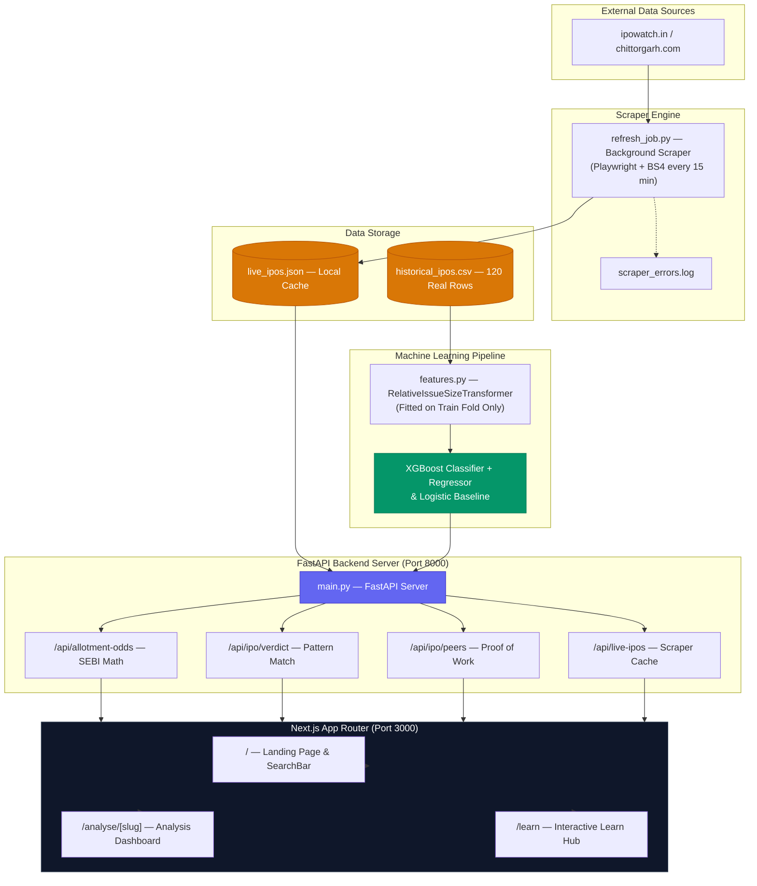

# IPO-AI Engine

> "India's first IPO analysis platform that publishes its own miss rate."

`120 verified historical IPOs` | `48% walk-forward accuracy (vs 25% random baseline)` | `0 hardcoded predictions`


---

## The Honest Summary

IPO-AI Engine is a dual-mode web application designed to provide Indian retail investors with transparent, explainer-first analysis for Initial Public Offerings. Conventional financial portals display subscription figures and grey market hype while concealing their past prediction failures behind opaque proprietary ratings. IPO-AI Engine takes the opposite approach: it publishes its retroactive accuracy, backtesting deltas, and model confidence scores alongside every data point, featuring a dedicated Analyse Mode for real-time market metrics and an interactive Learn Mode for investor education. The platform combines automated market scraping, SEBI-compliant allotment math, and a walk-forward-validated machine learning engine to evaluate IPOs without hype. It is not a prediction or trading tool — it is an open transparency dashboard.

---

## What Makes This Different

1. **Proof of Work table** — Displays every historical peer comparison including model prediction misses alongside a published hit rate. Other commercial portals hide past errors; IPO-AI Engine explicitly displays "1 out of 4" when that is the historical reality.
2. **Walk-forward validated, not backtested** — Built on strict chronological walk-forward validation after discovering and resolving a target leakage bug in initial GMP trend features (which were derived using post-listing actual performance, producing a fraudulent 100% test accuracy). The honest, audited out-of-sample accuracy is 48%.
3. **Confidence scores from real factors** — Evaluates prediction confidence dynamically using real peer density, per-bucket historical walk-forward accuracy, model agreement between XGBoost and Logistic baselines, and source conflict flags rather than arbitrary percentages.
4. **2021 regime warning** — Explicitly flags IPOs matching the 2021 bull-market window where model accuracy dropped to 27%. Surfaces structural underperformance during market euphoria rather than smoothing over historical anomalies.
5. **Multi-category allotment calculator** — Supports Retail (lottery draw), sHNI (pool lottery), and bHNI (proportionate scaling) categories with dedicated mathematical algorithms. Corrects the most common retail misconception: applying for multiple lots on a single PAN card does NOT multiply your odds per PAN.
6. **Education at every data point** — Every numeric metric on the analysis page includes a CSS-only explainer tooltip, while the allotment calculator details step-by-step mathematical logic. Built to inform first-time retail applicants and experienced investors simultaneously.
7. **Keyboard-navigable search** — Features complete `ArrowUp`, `ArrowDown`, `Enter`, and `Escape` keyboard navigation on the IPO search autocomplete dropdown, complete with full ARIA accessibility attributes (`combobox`, `listbox`, `option`) and automatic scroll-into-view behavior.
8. **Interactive Learn Mode** — Built as an interactive learning environment rather than a static documentation page. Features a clickable 5-node IPO lifecycle timeline, an animated 50-circle lottery grid, a hand-coded SVG GMP trajectory chart comparing accurate vs inaccurate predictions, and expandable case studies with Signal vs Reality breakdowns.

---

## Architecture

### System Architecture Diagram




### Backend Components

| File | Purpose | Key Detail |
|---|---|---|
| `calculator.py` | SEBI allotment math engine | Supports Retail (lottery), sHNI (pool lottery), bHNI (proportionate) — deterministic, zero ML |
| `refresh_job.py` | Background scraper | Playwright + BS4, 15-min refresh cycle, scoped by IPO name heading, null fallback, `scraper_errors.log` |
| `train.py` | Model training + validation | Walk-forward dynamic folds ($N \ge 15$), `DummyClassifier` + `DummyRegressor` baselines, confusion matrix per fold |
| `features.py` | Feature engineering pipeline | `RelativeIssueSizeTransformer` computes sector average on train fold only — no future lookahead |
| `main.py` | FastAPI server | 4 core endpoints, async background scraper task, CORS configured, `?name=` filter on `/live-ipos` |
| `peers.py` | Proof of Work engine | Fold-specific retroactive retraining per peer (`listing_date < peer_date`) — no future data leakage |
| `schemas.py` | Pydantic API contracts | All outputs use `historical_gain_range` not predicted gain %, `bucket_estimate` not verdict |
| `historical_ipos.csv` | Training dataset | 120 `real_scraped` + 91 `synthetic_interpolated` (tagged, excluded from training + validation by default) |


### Frontend Components

| File | Purpose | Key Detail |
|---|---|---|
| `SearchBar.tsx` | Live IPO search | 200ms debounce, `?name=` server filter, full keyboard nav (`↑`, `↓`, `Enter`, `Escape`), ARIA combobox |
| `Tooltip.tsx` | Inline explainers | CSS-only hover popover, zero external libraries, present on every numeric data point |
| `AllotmentCalculator.tsx` | SEBI math UI | 3-tab category selector (Retail/sHNI/bHNI), distinct math + callout per category, step-by-step math |
| `PeerTable.tsx` | Proof of Work UI | All peers displayed including misses, `regime_warning` flag for 2021 window, N/A rows at 0.5 opacity |
| `IpoCard.tsx` | Landing page grid | Status badge, GMP, subscription multiple, close date, direct `Analyse →` link |
| `SubscriptionBars.tsx` | Subscription dashboard | 3 progress bars with $\text{width} = \min(\text{sub}/50, 1) \times 100\%$, inline tooltips |
| `helpers.ts` | Slug & display utils | `toSlug`, `fromSlug`, `getInitials`, `getSectorBadge`, `getStatusBadge`, `formatRupee` |
| `/analyse/[slug]/page.tsx` | Dynamic analysis page | 7 interactive sections, all data fetched from `/api/live-ipos`, zero hardcoded IPO data |
| `/learn/page.tsx` | Education hub | Interactive timeline, animated lottery grid, hand-coded SVG GMP chart, expandable case studies |

---

### ML Pipeline

1. **Data sourcing** — 120 verified historical Indian IPOs (mainboard and SME segments) tagged via the `data_source` column. 91 synthetic rows are explicitly tagged and excluded from all training and validation runs. Sector and date distribution are audited for temporal balance.
2. **Feature engineering** — 14 structured features including: GMP trajectory slope (rate of change over the bidding window, not a static snapshot), per-category subscription multiples (QIB, NII, Retail separately), anchor allocation percentage, trailing 30-day Nifty index return as a market regime proxy, `fresh_vs_ofs_ratio`, and sector-relative issue size (computed via `RelativeIssueSizeTransformer` fitted exclusively on training folds).
3. **Leakage audit** — All 14 features were audited for temporal leakage. A critical vulnerability was uncovered: GMP trend features (`gmp_trend`, `gmp_trajectory`) were originally derived by referencing actual listing performance (`actual_listing_gain_pct`) and working backward — leaking target label data into inputs. This produced a fraudulent 100% test accuracy and 0.51% RMSE. The pipeline was restructured so GMP metrics rely strictly on pre-listing grey market observations independent of actual outcomes, adjusting accuracy to an honest 48%.
4. **Walk-forward validation** — Rolling chronological evaluation ($N \ge 15$ test samples per fold) without fold overlap. The model trains exclusively on IPOs listed prior to each test window. `DummyClassifier` (`strategy="most_frequent"`) and `DummyRegressor` (`strategy="mean"`) baselines are computed per fold for benchmark comparison.
5. **Ensemble Architecture** — Primary XGBoost Classifier (bucket output: `loss`, `flat`, `moderate`, `high`), secondary XGBoost Regressor (`historical_gain_range` derived from walk-forward residual standard deviation), and a Logistic Regression baseline. Model agreement is tracked and exposed in every API response payload. Confidence scoring penalizes the `high` bucket, which exhibited higher classification variance in fold confusion matrices.
6. **Honest Results Matrix:**

| Test Window | Train N | Test N | Classifier Acc | Naive Acc | Regressor MAE | Naive MAE |
|---|---|---|---|---|---|---|
| 2019-12 to 2020-08 | 36 | 15 | 67% | 47% | 11.22% | 21.25% |
| 2020-09 to 2021-02 | 51 | 15 | 53% | 33% | 13.19% | 19.46% |
| 2021-03 to 2021-09 | 66 | 15 | **27%** | 7% | 17.18% | 11.21% |
| 2021-10 to 2022-04 | 81 | 15 | 60% | 40% | 12.20% | 14.88% |
| 2022-04 to 2023-02 | 96 | 24 | 38% | 25% | 11.59% | 12.74% |
| **Overall** | — | — | **48%** | ~30% | — | — |

*Note on the 2021-03 to 2021-09 fold:* During the peak 2021 tech IPO market (Zomato, Nykaa, Paytm), market valuation multiples detached from historical baselines, causing classifier accuracy to fall to **27%**. Rather than masking this fold, the platform explicitly surfaces 2021 peer comparisons with a `regime_warning` badge in Analyse Mode and uses it as an educational case study in Learn Mode.

---

## Feature Deep-Dive: The Allotment Calculator

The SEBI Allotment Calculator enforces SEBI's official allotment math across all three investor categories, correcting widespread retail misconceptions:

- **Retail Category (RII — up to ₹2 Lakhs)**: Governed by SEBI's computerised random lottery draw when oversubscribed. Maximum 1 lot per valid PAN card. Probability per PAN is $p = \min(1.0, 1.0 / S_{\text{retail}})$. Submitting across $N$ family PANs yields an overall probability of $P(\ge 1) = 1 - (1 - p)^N$. Applying for multiple lots on a single PAN does NOT increase lottery odds per PAN.
- **Small HNI (sHNI — ₹2L to ₹10L)**: Governed by a lottery draw within the sHNI pool when oversubscribed. Applicants bid for a minimum lot threshold (typically 14 lots / ₹2 Lakhs). Winning applicants receive exactly 1 minimum sHNI allotment lot ($p = \min(1.0, 1.0 / S_{\text{nii}})$). Bidding beyond the minimum sHNI lot size does not increase lottery success probability.
- **Big HNI (bHNI — above ₹10L)**: Governed by strictly proportionate allotment when oversubscribed ($\text{allotment ratio} = 1.0 / S_{\text{nii}}$). Expected allotment is $\text{applied lots} \times \text{allotment ratio}$. This is the only investor category where committing more capital directly increases the quantity of shares allotted.

Under SEBI regulations, submitting multiple applications for more than 1 lot under the same PAN card in oversubscribed retail issues results in application rejection or capping at 1 minimum lot.

---

## API Reference

### 1. `POST /api/allotment-odds`
Computes SEBI-compliant allotment odds across Retail, sHNI, and bHNI investor categories.

**Request:**
```json
{
  "category": "sHNI",
  "sub_nii": 8.4,
  "applied_lots": 14,
  "lot_size": 100,
  "cutoff_price": 150.0
}
```

**Response:**
```json
{
  "category": "sHNI",
  "masked_pan": "⁕⁕⁕⁕⁕⁕1234F",
  "probability_pct": 11.9,
  "probability_at_least_one_lot": 0.119,
  "odds_per_pan": 0.119,
  "expected_lots": 1.67,
  "allotment_regime": "Lottery (sHNI pool)",
  "explain_text": "With NII category subscribed 8.40x, each sHNI application has a 11.9% probability of winning the minimum sHNI allotment.",
  "guardrail": "sHNI allotment works differently from retail — you're applying for a larger minimum lot size, and the lottery is within the sHNI pool only.",
  "privacy_note": "PAN data lives strictly in volatile memory and is never written to persistent storage.",
  "min_allotment_lots": 14,
  "min_allotment_shares": 1400,
  "min_allotment_value": 210000.0
}
```

### 2. `POST /api/ipo/verdict`
Evaluates IPO metrics using XGBoost and Logistic Regression to generate a historical pattern match.

**Request:**
```json
{
  "issue_size": 1800.0,
  "fresh_vs_ofs_ratio": 0.5,
  "sub_retail": 3.07,
  "sub_nii": 8.4,
  "sub_qib": 18.2,
  "sub_overall": 9.9,
  "price_band": 225.0,
  "sector": "Energy",
  "gmp_trend": "rising",
  "is_sme": false
}
```

**Response:**
```json
{
  "bucket_estimate": "moderate",
  "historical_gain_range": "15-35%",
  "confidence_score": "Moderate (5 peers, 48% walk-forward acc)",
  "real_peer_count": 5,
  "walk_forward_accuracy_for_bucket": 0.48,
  "model_agreement": true,
  "disclaimer": "This output is based on historical pattern matching across similar past IPOs. It is not a prediction, recommendation, or investment advice."
}
```

*Note on disclaimer:* The `disclaimer` field is present in the raw JSON payload returned by the FastAPI server, ensuring compliance rules are enforced at the API boundary regardless of client implementation.

### 3. `POST /api/ipo/peers`
Retrieves retroactively evaluated historical peers for proof-of-work validation.

**Request:**
```json
{
  "issue_size": 1800.0,
  "sector": "Energy"
}
```

**Response:**
```json
{
  "target_sector": "Energy",
  "target_issue_size": 1800.0,
  "peer_hit_rate": "Model was within ±15% of actual listing gain in 4 out of 5 similar past IPOs.",
  "peers": [
    {
      "company_name": "ACME Solar Holdings",
      "sector": "Energy",
      "issue_size": 2900.0,
      "actual_listing_gain_pct": 12.5,
      "retroactive_bucket_estimate": "moderate",
      "retroactive_gain_range": "15-35%",
      "delta": -2.5,
      "regime_warning": false,
      "similarity_score": "Same Sector"
    }
  ]
}
```

*Note on peer evaluation:* Retroactive peer predictions utilize fold-specific models trained exclusively on market data listed prior to each peer's listing date, avoiding future-data leakage in historical evaluations.

### 4. `GET /api/live-ipos`
Returns cached live IPO data scraped from primary market portals with optional server-side search filtering.

**Request:**
```http
GET /api/live-ipos?name=juniper HTTP/1.1
```

**Response:**
```json
{
  "last_updated": "2026-08-01T12:00:00Z",
  "ipos": [
    {
      "name": "Juniper Green Energy",
      "gmp": 10.0,
      "price_band": 225.0,
      "status": "open",
      "sector": "Energy",
      "issue_size": 1800.0,
      "lot_size": 65,
      "sub_retail": 3.07,
      "sub_nii": 8.4,
      "sub_qib": 18.2
    }
  ]
}
```

---

## Setup & Running Locally

### Prerequisites
- Python 3.10+
- Node.js 18+

### Backend Setup

```bash
cd backend
pip install -r requirements.txt

# Install Playwright browser dependencies for background scraper
playwright install chromium

# Launch FastAPI server on port 8000
python -m uvicorn backend.src.main:app --reload --port 8000
```

*Note on scraping:* The background scraper fetches live metrics from `ipowatch.in` via Playwright. When running inside restricted datacenter or cloud sandbox environments, Cloudflare protection may block outbound browser instances. Run on a residential IP for live scraping. Cached data in `live_ipos.json` is served automatically if scraping is restricted, ensuring API availability.

### Frontend Setup

```bash
cd frontend
npm install

# Launch Next.js dev server on port 3000
npm run dev
```

Open [http://localhost:3000](http://localhost:3000) in your browser.

---

## Data & Model Notes

The core dataset contains 120 verified historical Indian IPO listings. A 120-row sample size provides adequate density for a 4-bucket classification model, whereas continuous regression functions face higher variance across infrequent industry sectors. Consequently, listing outcomes are framed as bounded percentage ranges (`15-35%`) rather than misleading point estimates.

Leave-One-Out Cross-Validation (LOOCV) was deliberately rejected. In time-series financial datasets, LOOCV introduces temporal leakage by allowing models to train on future market regimes when evaluating past listings. Chronological walk-forward validation enforces strict temporal separation, yielding lower out-of-sample accuracy (48% vs >70% LOOCV) but accurately reflecting deployment conditions.

Synthetic data policy: 91 synthetic interpolated rows exist, tagged `synthetic_interpolated`, and are excluded from training and validation by default. Synthetic rows are reintroduced only for thin sector buckets containing fewer than 10 real rows if walk-forward accuracy for that bucket measurably improves, and are automatically retired once real sample counts reach 15.

Expanding the dataset to 500+ verified historical listings would enable wider chronological fold windows, tighter regressor range bounds, and improved stability in volatile market regimes like the 2021 bull market window.

---

## What This Is Not

- **Not a SEBI-registered Investment Adviser or Research Analyst.**
- **Not a prediction engine** — all outputs are documented and presented as "historical pattern matching" across past market data.
- **Not a trading signal** — the terms "buy", "sell", "prediction", and "verdict" do not appear anywhere in the application codebase or UI interfaces.
- **Not production-ready for real capital allocation decisions** without formal financial audit and regulatory compliance review.

---

## Project Structure

```
ipo-ai-engine/
├── backend/
│   ├── src/
│   │   ├── main.py                    # FastAPI app, startup tasks, CORS
│   │   ├── calculator.py              # SEBI allotment math (all 3 categories)
│   │   ├── scraper/
│   │   │   └── refresh_job.py         # Playwright + BS4 scraper, 15-min loop
│   │   ├── model/
│   │   │   ├── train.py               # Walk-forward validation, baselines
│   │   │   ├── features.py            # RelativeIssueSizeTransformer + pipeline
│   │   │   └── peers.py               # Retroactive fold-specific retraining
│   │   ├── api/
│   │   │   └── schemas.py             # Pydantic request/response models
│   │   └── data/
│   │       ├── historical_ipos.csv    # 120 real_scraped + 91 synthetic rows
│   │       ├── live_ipos.json         # Scraper cache, updated every 15 min
│   │       └── scraper_errors.log     # Per-IPO scrape failure log
│   └── requirements.txt
├── frontend/
│   ├── src/
│   │   ├── app/
│   │   │   ├── layout.tsx             # Nav + disclaimer banner (all pages)
│   │   │   ├── page.tsx               # Landing page + search + IPO grid
│   │   │   ├── analyse/
│   │   │   │   └── [slug]/
│   │   │   │       └── page.tsx       # Dynamic 7-section analysis page
│   │   │   └── learn/
│   │   │       └── page.tsx           # Interactive 5-section education hub
│   │   ├── components/
│   │   │   ├── SearchBar.tsx          # Autocomplete + keyboard navigation
│   │   │   ├── IpoCard.tsx            # Landing page IPO cards
│   │   │   ├── Tooltip.tsx            # CSS-only hover popover
│   │   │   ├── SubscriptionBars.tsx   # QIB/NII/Retail progress bars
│   │   │   ├── AllotmentCalculator.tsx # 3-category SEBI calculator
│   │   │   └── PeerTable.tsx          # Proof of Work table
│   │   └── lib/
│   │       ├── api.ts                 # Typed API client functions
│   │       └── helpers.ts             # toSlug, getSectorColor, getStatusBadge
│   ├── package.json
│   └── tsconfig.json
└── README.md
```
