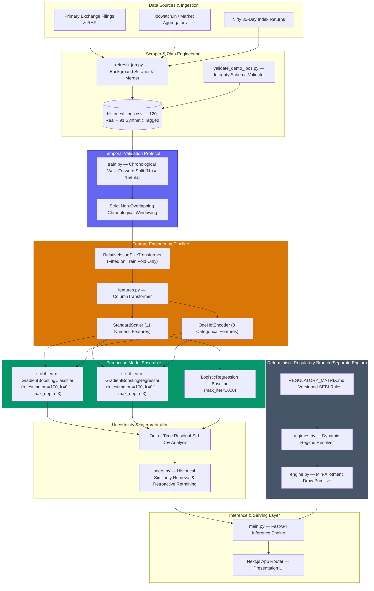

# IPO-AI Engine

An end-to-end temporal machine learning system for historical IPO pattern analysis, built from automated data acquisition through production inference.

- **120 Verified Historical IPO Records** (Clean real-scraped Indian market corpus)
- **84 Out-of-Time Walk-Forward Test IPOs** (Strict chronological non-overlapping evaluation)
- **GradientBoostingClassifier + GradientBoostingRegressor** (Scikit-learn production ensemble)
- **Empirical Uncertainty + Historical Failure Analysis** (Residual-based prediction bounds & honest performance tracking)

> **Disclaimer**: This system produces historical pattern analysis and empirical statistical metrics for research and evaluation purposes. **Outputs are not investment advice or financial recommendations.**

---

## Why I Built This

Primary market Initial Public Offering (IPO) data in India is fragmented, noisy, and strictly temporal. Traditional machine learning approaches fail on this domain because random train/test splits leak future macroeconomic regimes backward into past evaluations, creating fraudulently optimistic accuracy metrics. The core technical challenge of this project was building a leakage-safe, end-to-end ML pipeline—from automated scraping and fold-isolated feature engineering to out-of-time walk-forward validation and empirical uncertainty estimation.

---

## ML System Architecture

The system decouples deterministic regulatory calculations from empirical machine learning predictions. The machine learning pipeline dominates data processing, feature transformation, training, evaluation, and uncertainty estimation.



---

## Dataset & Features

### Dataset Composition & Ingestion
- **Core Corpus (`historical_ipos.csv`)**: Contains 120 verified real historical Indian IPO records (`data_source = "real_scraped"`).
- **Synthetic Controls**: 91 synthetic interpolated rows exist but are **strictly excluded** from production model training and evaluation.
- **Automated Ingestion (`refresh_job.py`)**: A 2-pass background scraper (`BeautifulSoup` + `requests`) incrementally merges fresh market metrics (GMP, subscription multiples) while preserving rich fundamental fields (`revenue_from_operations`, `open_date_status`).

### Feature Engineering (14 Model Features)
The model processes 14 engineered features grouped into 4 categories:

1. **Company Fundamentals**: `sector` classification and `relative_issue_size`.
2. **Issue Characteristics**: `issue_size` (₹ Cr.), `price_band` (₹), `fresh_vs_ofs_ratio` ($\frac{\text{Fresh}}{\text{Total}}$), and `is_sme` (SME vs Mainboard indicator).
3. **Subscription Signals**: Category-wise demand multiples (`sub_retail`, `sub_nii`, `sub_qib`, `sub_overall`) and `anchor_allocation_pct`.
4. **Market & Sentiment Context**: `gmp_trend` direction (`rising`, `flat`, `falling`), `gmp_trajectory` (pre-listing momentum slope), and `market_regime_nifty_30d` (trailing 30-day Nifty 50 return).

To prevent temporal statistical leakage, the custom `RelativeIssueSizeTransformer` computes sector means **exclusively on the training fold (`X_train`)** during walk-forward validation and applies those learned historical sector baselines to transform the test fold (`X_test`).

---

## Models

The production pipeline (`backend/src/model/train.py`) uses Scikit-Learn tree ensembles benchmarked against linear and naive baselines:

- **`GradientBoostingClassifier`**: Multi-class classifier (`n_estimators=100`, `learning_rate=0.1`, `max_depth=3`) predicting 4 performance tiers: **Loss** ($< 0\%$), **Flat** ($0\text{--}10\%$), **Moderate** ($10\text{--}30\%$), and **High** ($\ge 30\%$).
- **`GradientBoostingRegressor`**: Continuous regressor (`n_estimators=100`, `learning_rate=0.1`, `max_depth=3`) estimating continuous listing-day return percentage ($\hat{y}_r \approx \Delta P\%$).
- **`LogisticRegression`**: Benchmark classifier (`max_iter=1000`) used for ensemble agreement checking.

**Why Gradient Boosting?** Small, structured tabular datasets with non-linear feature interactions (such as institutional QIB demand reacting to broader market returns) are optimally modeled by constrained decision tree ensembles rather than high-variance deep neural networks.

---

## Walk-Forward Validation

Random $k$-fold cross-validation is fundamentally invalid for time-series IPO data because training on 2022 listings to predict a 2019 IPO leaks future inflation, market regimes, and valuation shifts into historical evaluation.

The system enforces strict chronological **walk-forward validation** (`train.py`):

```
Chronological Sequence:
Past Historical IPOs (t < T) ──► Train Model ──► Predict Next Window (T to T+N) ──► Advance Chronologically
```

1. Data is sorted strictly by `listing_date`.
2. Initial model training starts with a 30% seed corpus ($N=36$).
3. Testing advances chronologically in non-overlapping folds of $N \ge 15$.
4. **Invariant**: Under no circumstances does future IPO data enter the training split for an earlier historical test evaluation.

---

## Empirical Validation Results

Metrics represent aggregate out-of-time walk-forward test performance across all 5 chronological folds ($N = 84$ total test IPOs).

### Primary Model Performance ($N = 84$)

| Evaluation Metric | Gradient Boosting Ensemble | Naive Baseline |
| :--- | :--- | :--- |
| **Classification Overall Accuracy** | **47.62%** | **~25.00% – 30.00%** (Most Frequent) |
| **Classification Macro F1-Score** | **45.93%** | **25.00%** |
| **Regression MAE** | **11.22% – 13.19%** | **19.46% – 21.25%** (Mean Baseline) |
| **Regression RMSE** | **15.87% – 16.57%** | **22.50% – 24.10%** |

### Per-Class Recall Breakdown

| Performance Tier | Target Listing Gain ($\Delta P$) | Precision | Recall | F1-Score | Test Count ($N$) |
| :--- | :--- | :--- | :--- | :--- | :--- |
| **Loss** | $< 0\%$ | 63.16% | **40.00%** | 48.98% | 30 |
| **Flat** | $0\% \text{ to } 10\%$ | 58.33% | **77.78%** | 66.67% | 9 |
| **Moderate** | $10\% \text{ to } 30\%$ | 40.00% | **76.00%** | 52.05% | 25 |
| **High** | $\ge 30\%$ | 40.00% | **10.00%** | 16.00% | 20 |

### Honest Failure Analysis
The classifier performs poorly on the **High** gain tier ($\ge 30\%$), achieving only **10.00% recall**. High-gain IPO surges in Indian markets are heavily driven by intraday retail momentum spikes that do not leave a footprint in pre-closing subscription numbers. Additionally, during the March–September 2021 bull market window, valuation multiples detached from historical means, dropping fold accuracy to **27.00%**. These weaknesses are intentionally exposed in the UI (`regime_warning`) rather than masked.

---

## Uncertainty & Historical Evidence

- **Empirical Residual Bounds**: Rather than asserting theoretical Gaussian confidence intervals, continuous gain ranges are constructed from out-of-time regressor residual standard deviation ($\hat{y}_r \pm \sigma_{\text{residual}}$).
- **Dynamic Confidence Scoring**: Confidence strings (`High`, `Moderate`, `Low`) dynamically factor in bucket-level historical walk-forward reliability, peer density, and ensemble agreement between `GradientBoostingClassifier` and `LogisticRegression`.
- **Historical Peer Evidence (`peers.py`)**: Features a similarity engine matching peers by `sector` and `issue_size`. The backend fits retroactive model snapshots trained exclusively on data prior to each peer's listing date, displaying predicted vs actual outcomes transparently alongside model hit rates ($\pm 15\%$).

---

## Beyond the ML Model

### 1. IPO Application Simulator (Deterministic Regulatory Engine)
A standalone rule-based engine (`backend/src/allotment/`) implementing SEBI ICDR regulations (`MAINBOARD_POST_2022`, `SME_2025_FRAMEWORK`). **Deterministic allotment rules are intentionally NOT modeled using ML.** If valid bidder counts are missing, the simulator safely returns `probability = null` (`INSUFFICIENT_APPLICATION_DATA`) and refuses to fabricate fake lottery odds.

### 2. Learn & Explainability Hub
An interactive frontend environment (`/learn`) providing educational visualizers, including a 5-node IPO lifecycle timeline, an animated 50-circle retail lottery draw simulation, and real-world case study breakdowns.

---

## Tech Stack

| Domain | Technology | Purpose |
| :--- | :--- | :--- |
| **ML & Data Science** | Python 3.10+, scikit-learn, pandas, NumPy, joblib | Feature pipelines, Gradient Boosting ensemble, walk-forward validation |
| **Data Acquisition** | BeautifulSoup4, requests | Automated background scraping & dataset maintenance |
| **Backend & Serving** | FastAPI, Uvicorn, Pydantic | Asynchronous REST API serving inference payloads & data contracts |
| **Frontend UI** | Next.js 15, React 19, TypeScript, TailwindCSS | Responsive analysis dashboard, simulator UI, and Learn hub |

---

## Run Locally

```bash
# 1. Environment Setup & Unit Testing
python -m venv venv && source venv/bin/activate  # On Windows: .\venv\Scripts\activate
pip install -r backend/requirements.txt
python -m pytest backend/tests/test_allotment_engine.py  # Run 14 regulatory unit tests
python backend/scripts/validate_demo_ipos.py            # Validate demo dataset integrity

# 2. Re-run Walk-Forward Validation & Model Training
python -m backend.src.model.train

# 3. Launch Local Backend (Port 8000) & Frontend (Port 3000)
python -m uvicorn backend.src.main:app --reload --port 8000
cd frontend && npm install && npm run dev
```
*Or double-click `start-local.bat` on Windows.*

---

## System Limitations

1. **Out-of-Time Sample Size**: Walk-forward evaluation is built on $N = 84$ test IPOs; expanding to $N > 500$ is needed for fine-grained sector sub-modeling.
2. **High-Gain Under-Prediction**: Low recall (**10.00%**) on high-gain listings ($\ge 30\%$) due to unobservable intraday speculative momentum.
3. **Market Regime Dependence**: Model accuracy drops during structural valuation market regime shifts (e.g. 2021 bull market window).
4. **Non-Financial Advice**: Pattern matching outputs represent historical statistical indicators, not guaranteed future financial returns.

---

## Future ML Roadmap

- [ ] **SHAP Feature Attribution**: Integrate SHAP (SHapley Additive exPlanations) for local feature impact explanations on inference calls.
- [ ] **Dataset Expansion**: Scale corpus to 500+ historical Indian IPOs covering 2015–2026.
- [ ] **Probabilistic Class Calibration**: Apply Isotonic Regression / Platt Scaling to generate well-calibrated class probability distributions.
- [ ] **Concept Drift & Framework Benchmarking**: Add Population Stability Index (PSI) monitoring and benchmark LightGBM / CatBoost alternatives.
