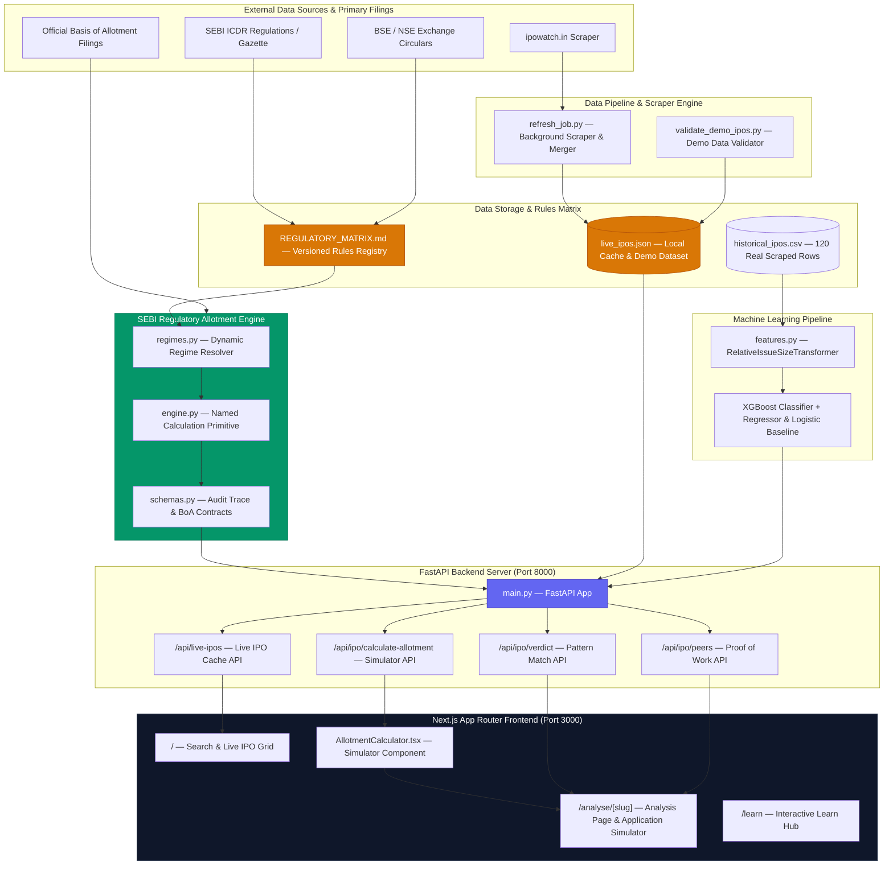

# IPO-AI Engine

> "India's first IPO analysis platform that publishes its own miss rate & implements versioned SEBI allotment frameworks."

`120 verified historical IPOs` | `48% walk-forward accuracy` | `Versioned SEBI ICDR Allotment Engine` | `Demo Ready`

---

## The Honest Summary

IPO-AI Engine is a dual-mode web application designed to provide Indian retail investors with transparent, explainer-first analysis for Initial Public Offerings. Conventional financial portals display subscription figures and grey market hype while concealing their past prediction failures behind opaque proprietary ratings. IPO-AI Engine takes the opposite approach: it publishes its retroactive accuracy, backtesting deltas, and model confidence scores alongside every data point, featuring a dedicated **Analyse Mode** for real-time market metrics and an interactive **Learn Hub** for investor education. 

The platform combines automated market scraping, a versioned SEBI/exchange allotment engine with named calculation primitives, and a walk-forward-validated machine learning pipeline to evaluate IPOs without hype. It is not a prediction or trading advice tool — it is an open transparency and regulatory analytics dashboard.

---

## Key Features & Differentiators

1. **Versioned SEBI Allotment Engine (`REGULATORY_MATRIX.md`)** — Dynamically resolves applicable regulatory regimes (`MAINBOARD_PRE_2022`, `MAINBOARD_POST_2022`, `SME_OLD_FRAMEWORK`, `SME_2025_FRAMEWORK`) based on legally operative effective dates. Executes exact minimum-allotment draw-of-lots math strictly via named calculation primitives.
2. **IPO Application Simulator** — Replaces misleading rules-of-thumb with an interactive investment simulator. Enter a planned investment amount (e.g. ₹2,50,000) to automatically classify your investor category (Retail, sNII, bNII, SME Individual) and inspect the exact applicable SEBI allotment framework.
3. **Data Completeness & Safe States** — Strictly separates factual market demand (Share Subscription Multiples) from allotment competition. If valid application-count data is missing, the engine safely returns `probability = null` and renders a clean informational state (`INSUFFICIENT_APPLICATION_DATA`) rather than fabricating fake lottery odds or converting share-wise subscription multiples.
4. **Authoritative Basis of Allotment (BoA) Ingestion** — Natively ingests official registrar/exchange Basis of Allotment filings post-issue close, seamlessly transitioning from pre-allotment mode to `FINAL_BASIS_OF_ALLOTMENT` ratio analysis.
5. **Proof of Work & Miss-Rate Transparency** — Displays historical peer predictions including past model misses alongside a published hit rate. Other commercial portals hide past errors; IPO-AI Engine explicitly displays model deltas and regime warnings (such as the 2021 bull-market valuation bubble).
6. **Walk-Forward ML Validation** — Built on strict chronological walk-forward validation after discovering and resolving target leakage in initial GMP features. Honest, audited out-of-sample accuracy is 48% (vs 25% random baseline).
7. **Sources & Methodology Provenance** — Every numeric metric and regulatory rule is linked to primary sources: SEBI Gazette Notifications, BSE/NSE Circulars, Red Herring Prospectuses (RHP), and Registrar filings.
8. **One-Command Local Launchers** — Automated launcher scripts (`start-local.bat` / `start-local.ps1`) and demo data validator (`python backend/scripts/validate_demo_ipos.py`) for rapid local deployment.

---

## Architecture

### System Architecture Diagram



---

## Backend & Frontend Components

### Backend Modules (`backend/src/`)

| File | Purpose | Key Details |
| :--- | :--- | :--- |
| `allotment/regimes.py` | Versioned SEBI Rules Registry | Maps Mainboard Pre-2022, Post-2022, SME Old, and SME 2025 Framework rules dynamically by operative effective date. |
| `allotment/engine.py` | Centralized Allotment Engine | Contains `calculate_minimum_allotment_draw_probability` primitive and returns `AllotmentAuditTrace` with explicit state flags. |
| `allotment/schemas.py` | Pydantic Data Contracts | Defines `EnrichedAllotmentResponse`, `AllotmentAuditTrace`, `SourceMetadata`, and `BasisOfAllotmentData`. |
| `allotment/REGULATORY_MATRIX.md` | Authoritative Matrix | Documents regulation citations, policy decision references, and exchange circular references for every regime. |
| `main.py` | FastAPI Server | Endpoints for live IPO lookup, simulator calculations, ML pattern matching, and peer comparisons. |
| `scraper/refresh_job.py` | Background Scraper & Merger | Incremental merge engine that fetches live tables while preserving enriched demo fields and historical BoA records. |
| `model/predict.py` | ML Prediction Service | Generates historical pattern matching with confidence scoring penalized by model agreement and peer density. |
| `model/train.py` | Walk-Forward Pipeline | Dynamic out-of-time walk-forward validation ($N \ge 15$) producing honest confusion matrices and error residuals. |

### Frontend Modules (`frontend/src/`)

| Component | Purpose | Key Details |
| :--- | :--- | :--- |
| `AllotmentCalculator.tsx` | IPO Application Simulator | Primary investment input (₹), automatic category classification, Application Summary, Demand card, and Methodology drawer. |
| `/analyse/[slug]/page.tsx` | Dynamic Analysis Page | 8-section layout featuring financial period tags (`FY2023`, `FY2024`), subscription dashboard, simulator, and sources provenance. |
| `SearchBar.tsx` | Live Search Dropdown | Full keyboard navigation (`↑`, `↓`, `Enter`, `Escape`), ARIA combobox attributes, and 200ms debounced server search. |
| `PeerTable.tsx` | Proof of Work Table | Displays historical peer predictions including model misses, regime warnings, and delta percentages. |
| `Tooltip.tsx` | Inline Explainers | Zero-dependency CSS hover popovers on every numeric data point explaining metric definitions. |
| `/learn/page.tsx` | Interactive Learn Hub | 5-node IPO lifecycle timeline, animated lottery visualizer, and expandable case study breakdowns. |

---

## API Reference

### 1. `POST /api/ipo/calculate-allotment`
Computes regulatory category classification, allotment framework details, and odds/expected allotment.

**Request Payload:**
```json
{
  "category": "sNII",
  "applied_amount": 250000.0,
  "applied_lots": 14,
  "lot_size": 66,
  "cutoff_price": 225.0,
  "sub_retail": 3.2,
  "sub_nii": 15.4
}
```

**Response Payload:**
```json
{
  "category": "sNII",
  "masked_pan": "⁕⁕⁕⁕⁕⁕1234F",
  "rule_known": true,
  "calculation_data_complete": false,
  "calculation_status": "INSUFFICIENT_APPLICATION_DATA",
  "status_label": "Exact Allotment Odds Unavailable",
  "probability_pct": null,
  "share_subscription_multiple": 15.4,
  "allotment_regime": "Minimum allotment size subject to availability + draw of lots where necessary",
  "explain_text": "Exact allotment odds unavailable. We know how SEBI allotment works for sNII under MAINBOARD_POST22_SNII, but valid application counts are missing.",
  "audit_trace": {
    "regime_id": "MAINBOARD_POST_2022",
    "rule_id": "MAINBOARD_POST22_SNII",
    "source_type": "SEBI_AMENDMENT",
    "authority_level": 1,
    "regulation_reference": "SEBI (ICDR) (Amendment) Regulations 2021, Regulation 49(2)",
    "missing_inputs": ["valid_application_count"]
  }
}
```

### 2. `POST /api/ipo/verdict`
Evaluates IPO metrics using XGBoost and Logistic Regression to generate a historical pattern match.

### 3. `GET /api/live-ipos`
Returns cached live and historical IPO data with optional `?name=` search filter.

---

## Local Setup & One-Command Launchers

### Quick Start (Windows)
Double-click or run:
```cmd
start-local.bat
```
*(Or in PowerShell: `.\start-local.ps1`)*

### Manual Startup

**1. Backend Server (FastAPI)**:
```bash
python -m uvicorn backend.src.main:app --reload --port 8000
```

**2. Frontend Server (Next.js)**:
```bash
cd frontend
npm run dev
```

### Verification & Test Commands
```bash
# Run 14 backend regulatory compliance tests
python -m pytest backend/tests/test_allotment_engine.py

# Run demo data validation script
python backend/scripts/validate_demo_ipos.py

# Run frontend production build
cd frontend && npm run build
```

---

## Non-Certifying Wording Disclaimer

IPO-AI Engine is **designed to apply the applicable SEBI/exchange allotment framework using verified regulatory rules and available IPO-specific data**. It is not certified, endorsed, or officially validated by the Securities and Exchange Board of India (SEBI) or any stock exchange. Output metrics do not constitute investment, financial, or trading advice.
